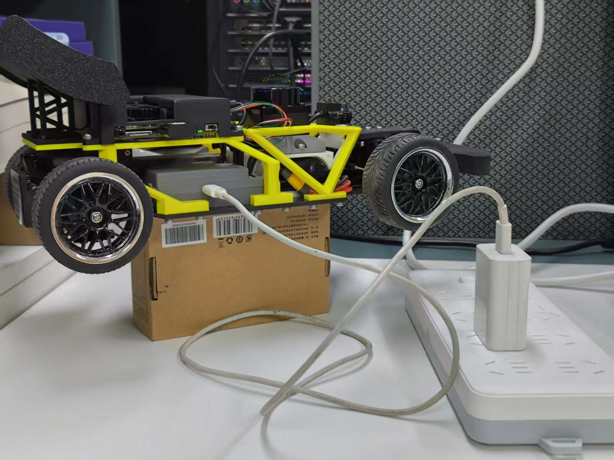
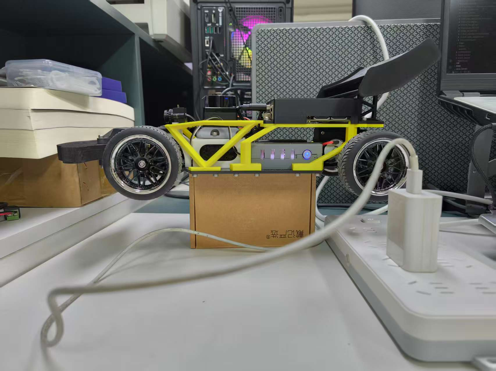

<!-- backgroundImage: url("../images/title.png") -->

# 🏎️ 快速上手指南

**准备好让你的赛车跑起来了吗？**

---

## ⚡ 如何开机

1. **电源系统**：
   - **底盘电池**：短按查看电量，长按听到“嘀”声放开，确认指示灯亮起。
   - **RDK X5 计算平台**：系统会自动随电源启动。
2. **电调开关**：
   - 在车体左侧找到电调（电机控制器）开关。
   - 拨动开关，你会听到“嘀 嘀嘀”的清脆提示音，这意味着动力系统已就绪。

> 💡 **小贴士**：开机后请先将小车放在架高的**调车台**上，防止误操作导致赛车直接冲出去！

---

## 🛑 安全关机

计算平台就像一台微型电脑，如果你直接拔掉电源，可能会损坏系统文件（损坏存储卡）。

1. **优雅退出**：
   - 通过 SSH 登录 RDK X5。
   - 输入命令：`sudo shutdown now`。
2. **物理断电**：
   - 等待主板指示灯完全熄灭。
   - 长按电池电源键关闭总电源。
   - **最后一定要记得关闭电调开关！**（防止电池过放电损坏）。

---

## 🔋 关于充电

当听到电量报警声或电灯闪烁时，请及时充电。

- **无需拆卸**：您可以直接连接车身上的充电接口。
- **专用设备**：请务必使用原厂配套的平衡充，保护锂电池寿命。

---

## 🕹️ 无线遥控模式

Formula Mini 支持多种遥控器，让你像玩遥控赛车一样控制它。

### 乐迪 T8S 遥控器
- **开启**：长按电源键。
- **优势**：极低的延迟，专业级的遥控距离。

---

## ⚠️ 安全警告

1. **循序渐进**：推摇杆时请“温柔”一点，赛车动力强劲，新手极易撞墙。
2. **电池保护**：长期不使用时，**请务必断开电池**，锂电池过放（电量降到 0）会导致电池直接报废。
3. **失速警告**：如果后退时发出 `dang en` 的声音，说明你操作太猛触发了保护，请松开摇杆重试。

---

# 🏁 下一步：开启自动驾驶之旅！

---

