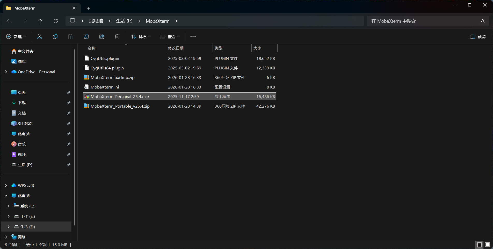
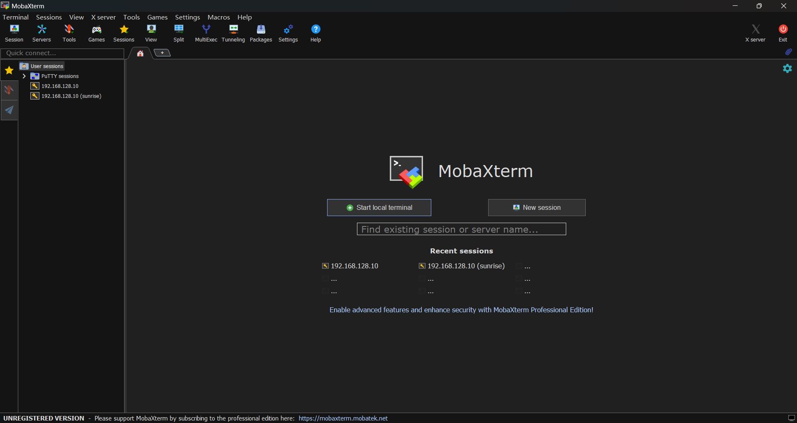
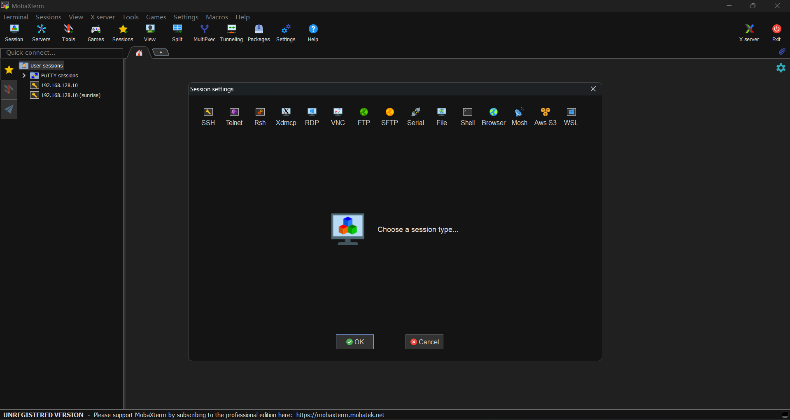
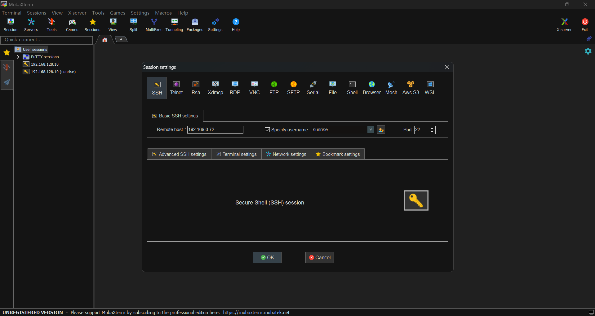
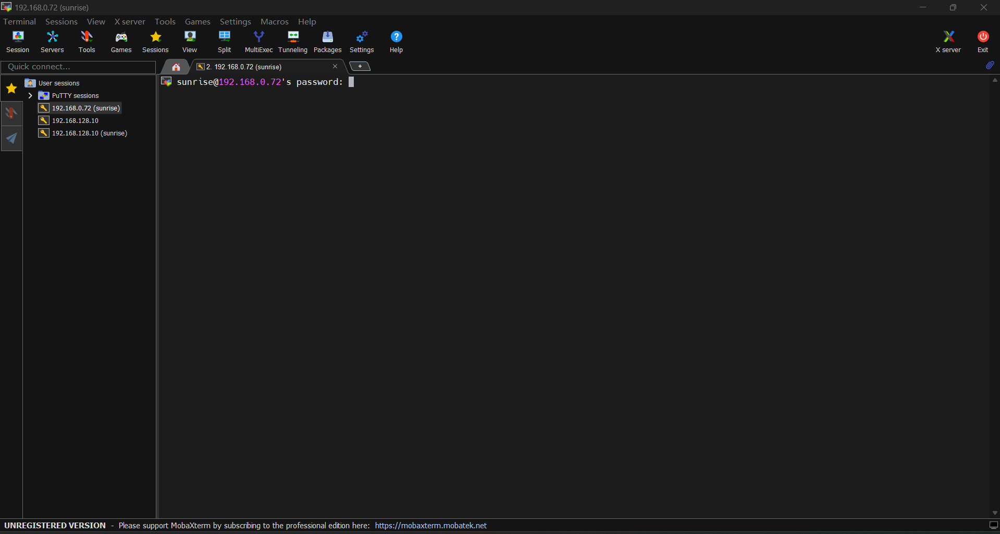
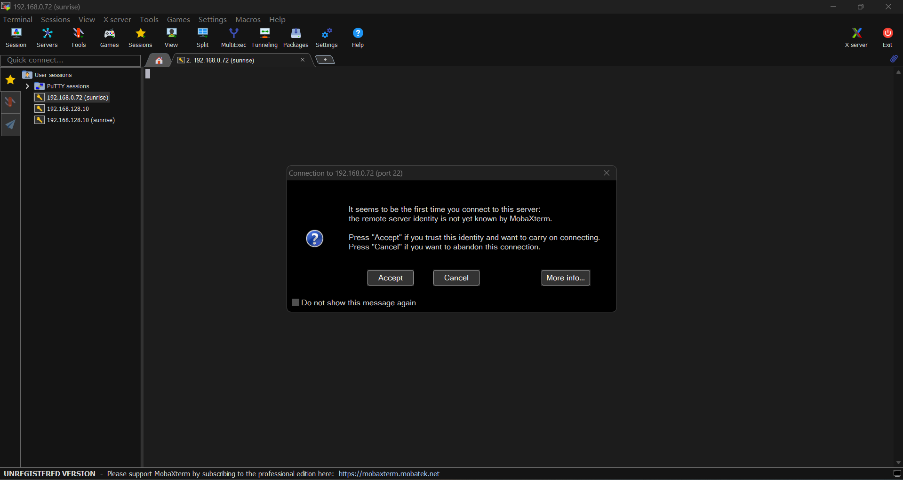
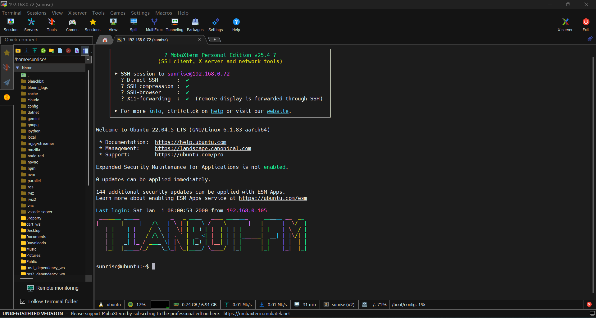
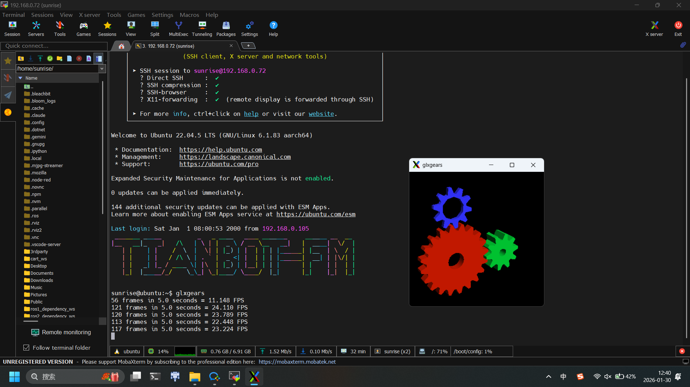
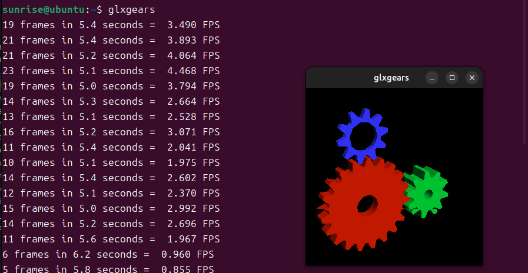
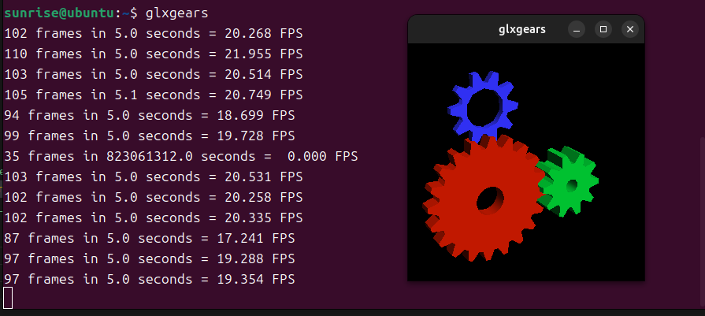

<style>
img {
  display: block;
  margin: 0 auto;
}
</style>

# 3-2 SSH 工具：MobaXterm 与 X11 转发

**目标**：掌握 MobaXterm 远程连接及图形界面显示

---

## 📋 本节目录

1. 认识 MobaXterm
2. 使用 SSH 远程登录
3. 神奇的 X11 转发
4. 实战练习

---

# 1️⃣ 认识 MobaXterm

---

## 为什么需要 MobaXterm？

**痛点**：
普通的黑白命令行窗口（CMD/PowerShell）：
- 功能太单一
- 传文件很麻烦
- 记不住复杂的命令

---

**解决方案**：
**MobaXterm** 就像是 SSH 界的 "瑞士军刀"
- ✅ 集成了终端（输命令）
- ✅ 集成了文件管理（拖拽传文件）
- ✅ 界面好看，功能强大

---

## 下载与安装 📥

**步骤简单**：

1. 访问官网下载免费便携版（[Home Edition portable](https://download.mobatek.net/2542025111600034/MobaXterm_Portable_v25.4.zip)）
2. 解压下载的压缩包
3. 直接双击运行 `.exe` 文件（绿色免安装）,仅仅支持`Windows`客户端

> **💡 提示**：建议将软件放在专门的工具文件夹中，方便查找。

---



---




---

# 2️⃣ 使用 SSH 远程登录

---
## 第一步：创建会话 🔌

点击左上角的 `Session`（会话）按钮，选择 `SSH`。

**说明**：这是连接远程计算机的第一步。


---



---

## 第二步：填写连接信息
我们需要填写三个核心信息：

1. **Remote host** (远程主机)：目标电脑的 IP 地址
2. **Specify username** (用户名)：登录账号（如 `ubuntu`）
3. **Port** (端口)：默认是 `22`

---



--- 


**类比**：
- IP = 房子的地址 🏠
- 用户名 = 你的名字 👤
- 端口 = 房门号 🚪

---

## 第三步：输入密码 🔑

点击 `OK` 后，会提示输入密码：

1. 在黑框中输入密码
2. **注意**：输入密码时**屏幕上不会显示任何字符**（这是为了安全！）
3. 输完直接按 `Enter` 回车

> **⚠️ 常见错误**：以为键盘坏了没反应，其实已经输进去了。

---



---



---

## 登录成功界面



---



---

**界面分区**：
- **左侧**：文件管理器（可以直接拖拽上传/下载文件）
- **右侧**：黑色的终端窗口（输入命令的地方）

---

# 3️⃣ 神奇的 X11 转发

---
## 什么是 X11 转发？ 🖼️

**普通 SSH**：
只能看到黑底白字的文字，无法运行图形化软件。

**X11 转发 (Forwarding)**：
让远程电脑的图形软件，显示在你的本地屏幕上！

**类比**：
就像**云游戏** 🎮 —— 游戏在服务器上运行，画面传到你的屏幕上。

---

## 如何开启 X11 转发？ ✅

只需要在使用`ssh`命令是加上`-X`的参数

### 使用原生ssh
```bash
ssh -X sunrise@192.168.0.71  
```

### 使用压缩加速ssh
```bash
#使用 -C 开启压缩，-c 使用更轻量的加密方式（如 blowfish 或 aes128-ctr）
ssh -X -C -c aes128-ctr  sunrise@192.168.0.71  
```

---

## 验证 X11 是否开启

```bash
glxgears # 会在宿主机器上开启一个图形化终端
```

---

### 原生ssh X11 转发 



---

### 压缩加速ssh X11 转发



---

