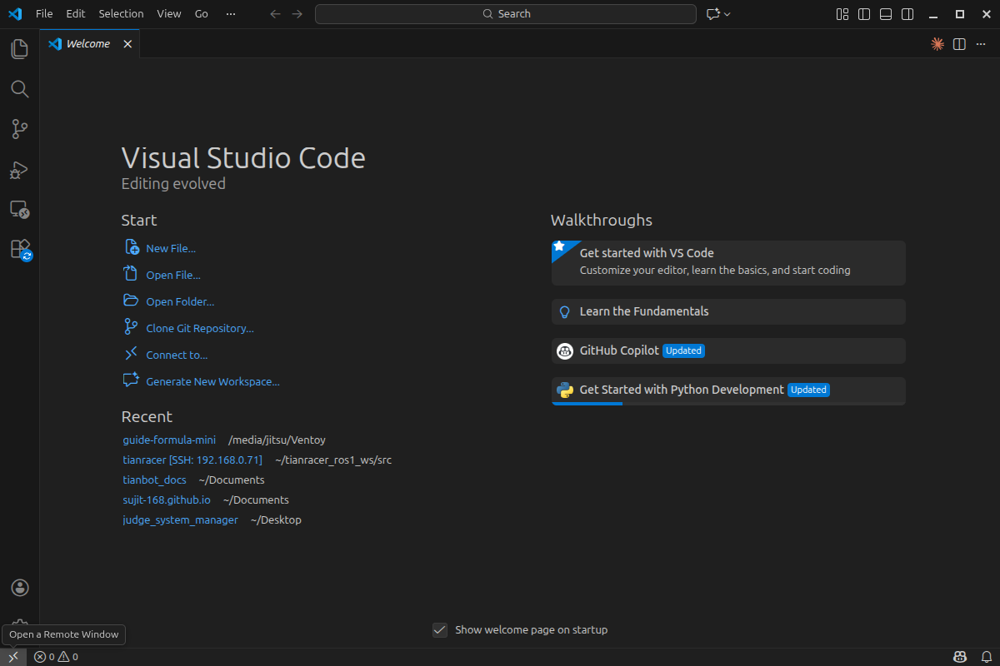
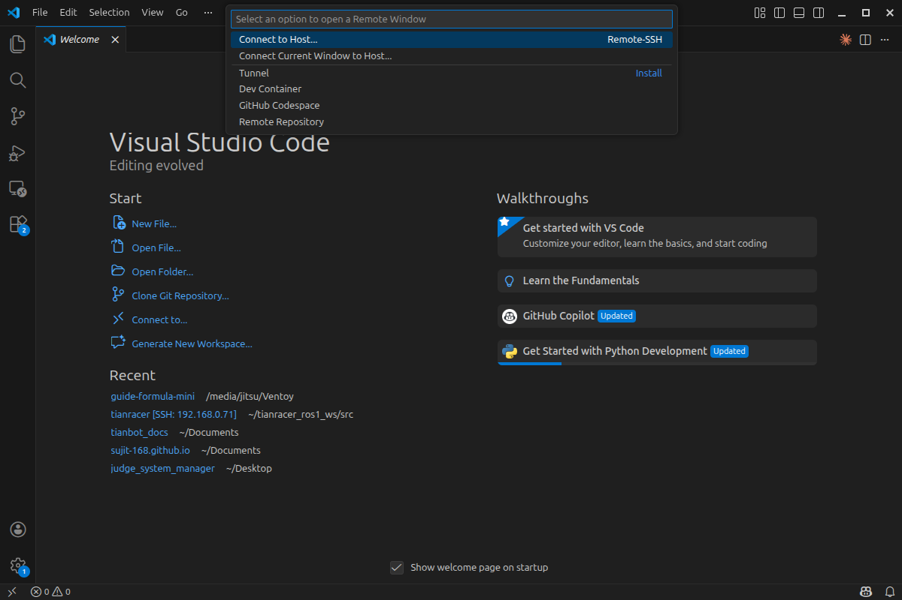
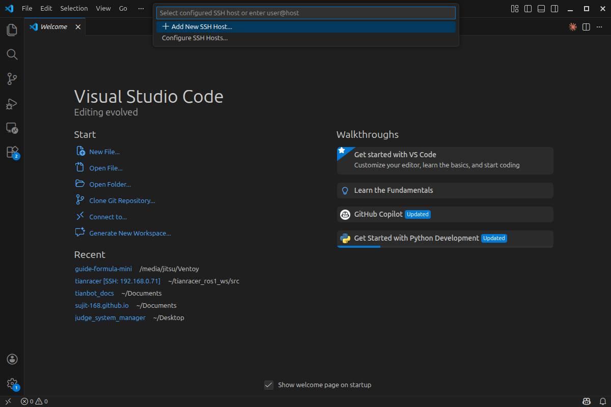
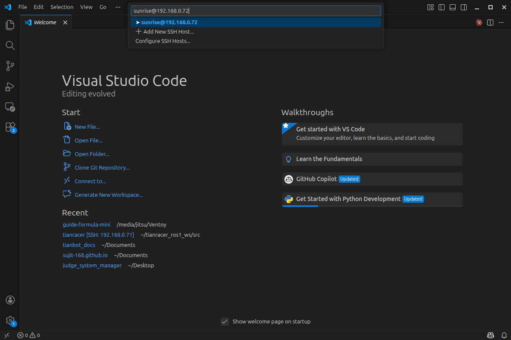
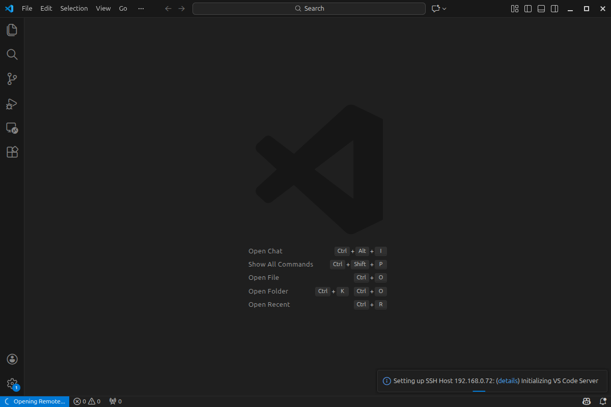

<!-- backgroundImage: url("../images/title.png") -->

# 第 3-3 讲：VS Code 远程连一连 💻

**想一想**：如果在机器人上改代码，非要插显示器吗？
**目标**：用你自己的电脑，像改本地文件一样改机器人的代码。

---

## 三步走战略

1. **装插件**：让软件具备远程功能
2. **输地址**：告诉它机器人的位置
3. **输密码**：验证身份，正式连接

---

# 第一步：安装插件

1. 打开 VS Code，点击左侧“四个方块”图标 🧊
2. 在搜索框输入：`Remote SSH`
3. 认准 Microsoft 出品，点击 **Install** 安装

---

# 第二步：输入地址

1. 点击左下角蓝色的两个小箭头 `><`

---

---
2. 在弹出菜单选：`Open SSH Host...` -> `Add New SSH Host...`

---

1. 弹出的框里输入：`ssh 用户名@IP地址`
- *例子*：`ssh sunrise@192.168.128.10`

2. 按回车，选择第一个配置文件保存。

---
# 第三步：输入密码 🔑

1. 再次点击左下角蓝色图标 `><`
2. 这一次选择：`Connect to Host...`
3. 点击你刚才填写的那个 IP 地址
4. 在屏幕上方正中间输密码（没字符显示是正常的），按回车。

---

---

# 🎉 连接成功！

**看到这个就是成功了**：

- 左下角显示 `SSH: 192.13-38...`
- 点击“打开文件夹”，就能看到机器人里的文件了。

---

## ⚠️ 小贴士

- **WiFi**：电脑和机器人必须连在同一个 WiFi 下！
- **没反应？**：检查机器人是不是开机了。
- **输错字？**：点击菜单里的 `Configure SSH Hosts` 删掉重写。

---

# 📚 本节练习

- [ ] 成功安装远程插件
- [ ] 第一次靠输密码进入机器人
- [ ] 成功配置“免密码登录”

---

# 感谢学习！🤝

**下节预告**：
在 VS Code 里跑通第一个 ROS 程序

<!-- _footer: ■ 实践出真知，代码跑起来！ -->

---

