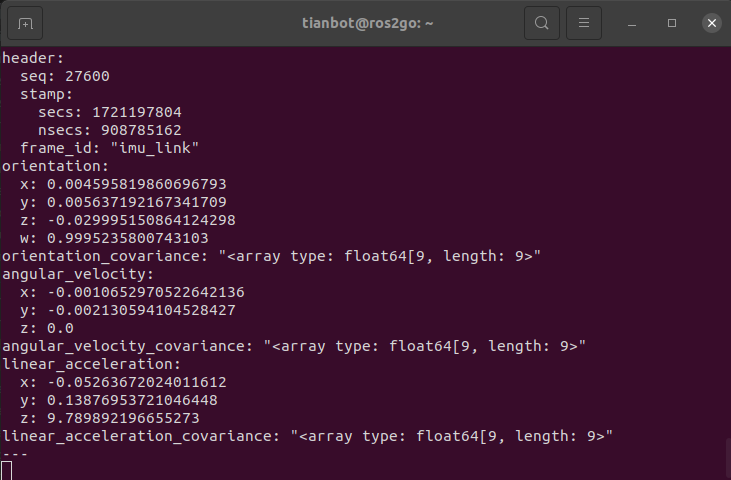
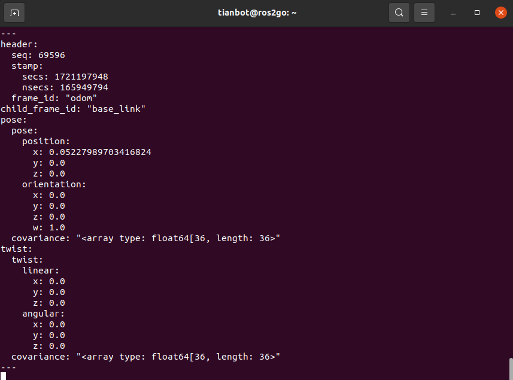
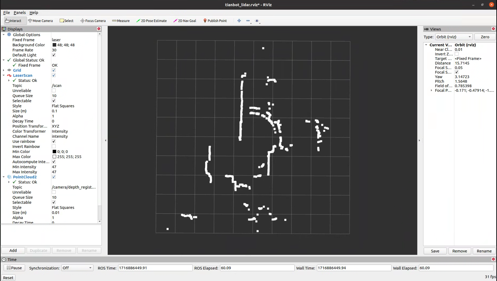
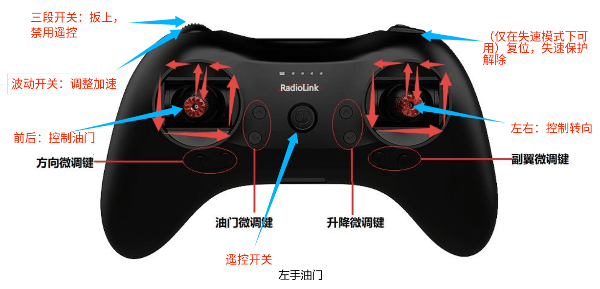

<style>
img {
  width: 60%; 
  height: auto; 
  display: block;
  margin: 0 auto;
}
</style>

<!-- backgroundImage: url("../images/title.png") -->

# 🤖 ROS 基础功能实战

**走进 TIANRACER 的机械世界**

---

## 📋 本节目录
1. 传感器大揭秘 👁️
2. 指挥底盘运动 🎮
3. 遥控器与 ROS 通信 📡
4. 消息类型的奥秘 ✉️

---

# 1️⃣ 传感器大揭秘 👁️

---

## 1.1 驱动底盘与传感器
TIANRACER 的底盘就像机器人的“双腿”和“平衡仪”：
- **编码器**：记录走了多远。
- **IMU**：感受身体的倾斜和旋转。

```bash
# 启动底盘心脏
roslaunch tianracer_core tianracer_core.launch

# 监听平衡数据 (IMU)
rostopic echo /tianracer/imu

# 监听里程计 (走了多远)
rostopic echo /tianracer/odom
```

---

### IMU 平衡数据可视化


**说明**：上图展示了机器人感受到的加速度和角速度。

---

### 运行轨迹 (Odom)


**说明**：里程计记录了机器人在空间中的位置坐标。

---

## 1.2 激光雷达：机器人的眼睛 🔦
激光雷达通过发射激光，测量周围物体的距离：

```bash
# 启动雷达眼睛
roslaunch tianracer_bringup lidar.launch

# 在屏幕上看雷达画出的地图
roslaunch tianracer_rviz view_lidar.launch
```

---

### 雷达扫描效果


> ⚠️ **注意**：查看时请确保 RViz 中的“Topic”设置正确！

---

##  一行命令启动整车所有传感器和执行机构驱动

```bash
roslaunch tianracer_bringup tianracer_bringup.launch
```

---

# 2️⃣ 如何控制底盘运动 🕹️

---

## 2.1 遥控器直接控制
TIANRACER 使用专业的 `乐迪 T8S` 遥控器，就像玩赛车游戏一样简单。



---

- **左摇杆**：前进/后退。
- **右摇杆**：左右转向。
- **S1 拨码**：扳上为禁止遥控（交给 ROS 操控），扳中为手动遥控。

---

# 3️⃣ ROS 话题通信控制 📡

---

## 3.1 阿克曼指令 (Ackermann)
对于像赛车一样转向的 TIANRACER，我们使用特殊的“阿克曼”指令。

```bash
# 发射“前进+右转”魔法
rostopic pub /tianracer/ackermann_cmd ackermann_msgs/AckermannDrive \
"{steering_angle: 1.57, steering_angle_velocity: 0.0, speed: 0.6, acceleration: 0.0,  jerk: 0.0}" -r 10
```

- **speed**：车轮转动的车速。
- **steering_angle**：前轮转动的角度（弧度制）。

---

## 3.2 速度矢量指令 (Twist)
你可能更熟悉通用的 ROS `Twist` 消息，我们可以进行转换。

**第一步：启动转换器**
```bash
rosrun tianracer_navigation cmd_vel_to_ackermann_drive.py \
                     _twist_cmd_topic:=/tianracer/cmd_vel \
            _ackermann_cmd_topic:=/tianracer/ackermann_cmd
```

**第二步：发送通用指令**
```bash
rostopic pub /tianbot_01/cmd_vel geometry_msgs/Twist \
"{linear: {x: 1.0, y: 0.0, z: 0.0}, angular: {x: 0.0, y: 0.0, z: 0.0}}"
```

---

# 4️⃣ 键盘操控大挑战 ⌨️

---

## 4.1 键盘遥控实战
如果你想用键盘控制机器人，我们需要把按键变成指令。


```bash
# 运行键盘控制程序，并“重映射”话题
roslaunch tianracer_teleop keyboard_teleop.launch
```
或者

```bash
# 运行键盘控制程序，并“重映射”话题
rosrun teleop_twist_keyboard teleop_twist_keyboard.py cmd_vel:=/tianracer/cmd_vel
```

💡 **小窍门**：
- 如果报错“Cannot find ...”，请先安装：
  `sudo apt install ros-$ROS_DISTRO-teleop-twist-keyboard -y`

---

## 4.2 rqt 可视化发布器
不想敲代码？用图形界面点点点也行！

```bash
rosrun rqt_publisher rqt_publisher
```

---

<!-- _footer: ■ 实践是检验真知的唯一标准 -->

# 🏁 本节总结

| 功能 | 命令关键包 | 作用 |
| :--- | :--- | :--- |
| 底盘驱动 | `tianracer_core` | 获取里程计与位姿 |
| 视觉捕获 | `usb_cam` | 获取彩色实时图像 |
| 路径指令 | `ackermann_msgs` | 控制转向与速度 |

---


