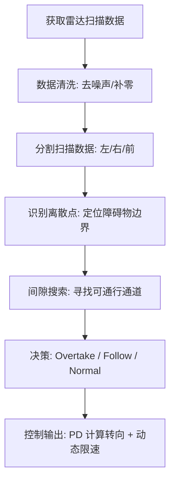

<!-- backgroundImage: url("../images/title.png") -->

# 9 NPU-IUS 智能避障算法解析 

**让无人车像专业赛车手一样思考与行动**

---

## 本节目录

1. 什么是 NPU-IUS 算法？
2. 算法核心流程概览
3. 数据预处理：给雷达“洗澡”
4. 障碍物提取与“膨胀”
5. 寻找最优前进方向
6. 跟随与超车策略
7. 速度与驱动力的控制
8. 实战：不同路况的应对策略

---

# 1 什么是 NPU-IUS 算法？

## 1.1 核心定义

**NPU-IUS 算法** 是一种基于 **激光雷达（Lidar）** 数据的实时路径规划与避障控制算法。

它就像是无人车的“大脑”：
- **感知**：通过雷达扫描周围环境。
- **思考**：在密集的障碍物中寻找“空隙”（Gap）。
- **行动**：计算出最安全、最快速的方向并踩下“油门”。

---

## 1.2 比喻法理解

想象你在一个拥挤的商场里飞奔：
1. **扫视**：你迅速看一眼前方 180 度的范围。
2. **找路**：你发现左侧有三个人，右侧有一堵墙，中间有一个 2 米宽的走廊。
3. **决策**：你决定向中心走廊冲过去，并根据走廊的宽度决定是全速前进还是减速。

**这，就是 NPU-IUS 在做的事情！**

---

# 2 算法核心流程概览



---

## 2.2 核心函数：`middle_line_callback`

这是整个算法的“中枢神经”。

- **触发机制**：每当激光雷达更新一次数据，该函数就会执行。
- **职责范围**：负责数据处理、环境识别、路径决策以及发送控制。
- **输入信息**：激光雷达的距离（Ranges）和光强（Intensities）。

---

# 3 数据预处理：给雷达“洗澡”

## 3.1 零值修复 `fill_zeros_with_neighbors`

雷达有时会因为反射或角度问题返回 `0`。

```python
def fill_zeros_with_neighbors(data):
    # 如果当前点是 0，取它左侧或右侧的最近邻居
    # 就像你眯起眼看不清时，参考一下旁边的画面
```

**目的**：防止算法误以为前方有一个“无限远”的洞而冲过去。

---

## 3.2 异常点滤波 `filter_anomalous_values`

去掉雷达数据中的“毛刺”。

**为什么要滤除？** 
如果不滤除，无人车会因为一个微小的噪点而突然转向，导致“蛇形走位”。

```python
# 核心逻辑：
if 当前点与两边差异巨大:
    用两边的平均值替换它
```

---

# 4 障碍物提取与“膨胀”

## 4.1 识别障碍物边界

通过计算前后两点雷达距离的**变化率**来确定障碍物的边缘。

```python
# 核心代码段
if dis_obs_90[i] - dis_obs_90[i+1] > THRESHOLD_obs:
    Left_obs_orig.append(i+1) # 发现障碍物入口
elif dis_obs_90[i+1] - dis_obs_90[i] > THRESHOLD_obs:
    Left_obs_orig.append(i) # 发现障碍物出口
```

---

## 4.2 障碍物“膨胀”

无人车是有宽度的。

- **膨胀逻辑**：将识别出的障碍物范围向两边人为扩大约 10 个索引值。
- **公式参考**：`delta = min((end - start)/2 * (4 - middle_dist), 10)`
- **目的**：给车身留出安全余量，防止“蹭墙”或“撞桶”。

---

# 5 寻找最优前进方向

## 5.1 寻找“Gap”（间隙）

在过滤完所有障碍物后，剩下的“白色区域”就是可通行的间隙。

- **广度优先**：算法会优先寻找宽度大于 18 个索引（约 18 度）的间隙。
- **补偿机制**：如果一侧视野被遮挡严重，算法会自动向开阔一侧微调方向。
- **示例**：`max_dis_index` 补偿 `5 * abs(dist_left - dist_right)`。

---

# 6 跟随与超车策略 

## 6.1 动态障碍物识别

算法不仅能避开墙壁，还能识别前方的动态对手。

- **光强分析（Intensity）**：通过分析障碍物区域的反射光强差异来判断是否为车辆。
- **逻辑**：`if abs(avg_obs_inten - avg_scene_inten) > 5` 则认为存在动态障碍物。

---

## 6.2 决策分支

根据间隙大小和障碍物性质，做出以下选择：

- **跟随模式（Follow）**：前方有车且空间不够，限速为 `MIN_OBS_SPEED`（2.0m/s）。
- **超车模式（Overtake）**：发现大于 30 个索引的空隙，全速冲刺！
- **正常模式（Normal）**：赛道清空，按常规逻辑行驶。

---

# 7 速度与驱动力的控制

## 7.1 PD 控制转向

使用 **PD 控制器** 计算最终的 `steering_angle`。

$$转向角度 = P \cdot 误差 + D \cdot \text{误差变化}$$

| 参数 | 赛道状态 | P 值 | D 值 |
| :--- | :--- | :--- | :--- |
| **P** | 直道 | 1.1 | 0.2 |
| **P** | 弯道 | 1.5 | 0.2 |
| **D** | 边界危急 | 1.1 | 0.5 |

---

## 7.2 速度自适应计算

```python
# 速度计算核心公式
speed = 2.4 * (0.3 * math.exp(-np.clip(abs(angle), 0, 0.5)) + 0.7)
```

1. **指数级下降**：角度越大，速度跌落越快。
2. **保底动力**：`+0.7` 确保过弯时依然有动力，不会失速。
3. **动态增益**：`speed_rate` 在直道上会以 1.05 的比例不断累乘，实现极速。

---

# 8 实战：不同路况应对策略 

## 8.1 大直道狂飙

当目标方向在 $75^\circ$ 到 $105^\circ$ 之间时进入“直道模式”。

- **策略**：逐渐增加 `speed_rate`，封顶可达 3.0。
- **判断依据**：前方平均距离 `mean_straight` 越远，提速越狠。

---

## 8.2 紧急处理：隐藏款

**当雷达视野中完全找不到可行区域时（`max_dir_num == 0`）：**

- **动作**：保持上一次的方向。
- **降速**：`speed_rate *= 0.9` 连续进入则持续减速。
- **搜寻**：`turn_rate` 提升至 1.2 倍，试图尽快偏转视野找路。

---

# 本节总结

| 模块 | 对应技术 | 目标 |
| :--- | :--- | :--- |
| **前处理** | 均值滤波/零值修复 | 提升雷达数据可靠性 |
| **识别** | 梯度检测/区域膨胀 | 确立绝对安全空间 |
| **决策** | 间隙搜索/状态机 | 选择最快超车线路 |
| **执行** | PD 控制/指数配速 | 兼顾稳定与速度 |

---

# 实践课题

1. **观察现象**：在 RViz 中观察绿色箭头，看它在遇到障碍物时是如何偏转的。
2. **参数修改**：尝试将弯道的 `P` 值从 1.5 改为 2.0，观察车辆转向是否更灵敏。
3. **安全第一**：在修改 `MAX_SPEED_RATE` 后，请务必手持急停遥控器进行测试！

---

# 感谢学习！

**有问题请查阅：**
- [docs/8.follow_the_gap.md](docs/8.follow_the_gap.md)
- [src/tianracer/tianracer_navigation/script/use_to_battle_fast1.py](src/tianracer/tianracer_navigation/script/use_to_battle_fast1.py)

<!-- _footer: ■ 实践出真知，代码跑起来！ -->

---


